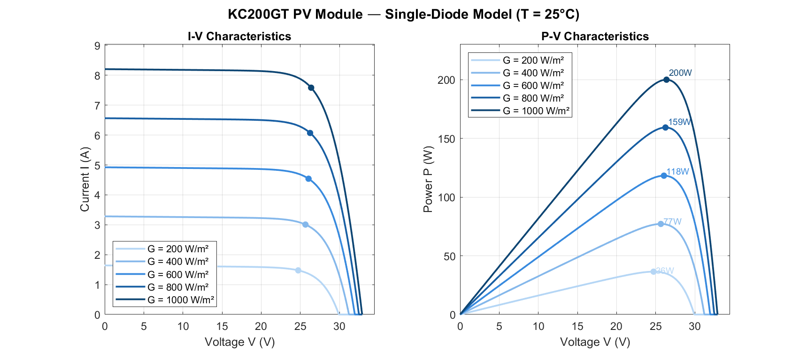
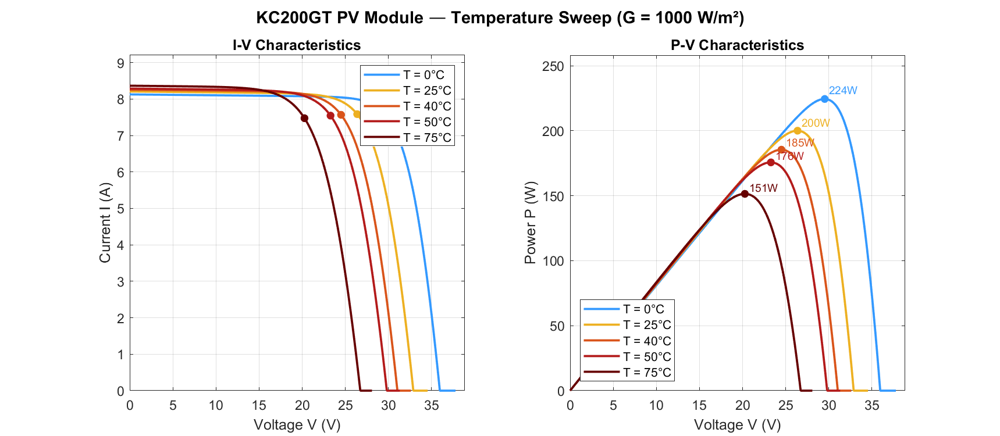

# PV Module I-V & P-V Curve Simulation — Single-Diode Model

**Module:** Kyocera KC200GT Polycrystalline (200 W)  
**Method:** Single-diode equivalent circuit, solved with Newton-Raphson iteration  
**Author:** Nazmul Islam Shimul, Petroleum & Mining Engineering, JUST, Bangladesh  
**Reference:** Villalva et al. (2009), *IEEE Transactions on Power Electronics*, 24(5), pp. 1198–1208. DOI: [10.1109/TPEL.2009.2017814](https://doi.org/10.1109/TPEL.2009.2017814)

---

## Overview

This project implements a physics-based simulation of a photovoltaic module using the single-diode equivalent circuit model. The simulation produces I-V (current–voltage) and P-V (power–voltage) characteristic curves under two independent parametric sweeps:

- **Irradiance sweep** — G = 200, 400, 600, 800, 1000 W/m² at fixed T = 25°C
- **Temperature sweep** — T = 0, 25, 40, 50, 75°C at fixed G = 1000 W/m²

Maximum Power Point (MPP) is identified for each operating condition and annotated on all plots.

---

## Output Figures

### Irradiance Sweep (T = 25°C)


At STC (G = 1000 W/m², T = 25°C), the model produces **Pmax ≈ 200 W**, **Vmpp ≈ 26.3 V**, **FF ≈ 74%** — consistent with the KC200GT datasheet and Villalva et al. (2009). Power scales near-linearly with irradiance; Voc decreases logarithmically as G drops.

### Temperature Sweep (G = 1000 W/m²)


At T = 0°C the module reaches ~224 W; at T = 75°C it degrades to ~151 W — a 33% reduction. This reflects the dominant negative temperature coefficient of Voc (−0.123 V/°C for the KC200GT), which is the primary driver of power loss in hot climates such as Bangladesh.

---

## Physics: Single-Diode Model

The governing equation is the implicit single-diode relation:

$$I = I_{ph} - I_o \left[\exp\!\left(\frac{V + IR_s}{V_t}\right) - 1\right] - \frac{V + IR_s}{R_{sh}}$$

where:

| Symbol | Description |
|--------|-------------|
| $I_{ph} = I_{sc} \cdot (G / G_{ref})$ | Photocurrent, scales linearly with irradiance |
| $I_o \approx I_{sc} / (\exp(V_{oc}/V_t) - 1)$ | Diode reverse saturation current (simplified, see note) |
| $V_t = n \cdot N_s \cdot kT/q$ | Thermal voltage across the series-connected cell string |
| $R_s$ | Series resistance (wiring and contact losses) |
| $R_{sh}$ | Shunt resistance (leakage current paths) |
| $n$ | Diode ideality factor |

Because $I$ appears on both sides, the equation has no closed-form solution. Newton-Raphson iteration converges to machine precision (tolerance $|ΔI| < 10^{-9}$ A) in under 10 iterations for all operating points tested.

**Note on $I_o$ approximation:** The saturation current is derived from the single operating-point relation above rather than the full temperature-dependent model ($I_o \propto T^3 \exp(-E_g/kT)$). This is a standard undergraduate approximation (Tamrakar et al., 2015) that produces accurate I-V curve shape and MPP estimation across the 0–75°C range used here.

**Temperature corrections** applied per-sweep iteration:

$$V_{oc}(T) = V_{oc,ref} + \beta_{Voc} \cdot (T - T_{ref}), \quad \beta_{Voc} = -0.123 \text{ V/°C}$$
$$I_{sc}(T) = I_{sc,ref} + \alpha_{Isc} \cdot (T - T_{ref}), \quad \alpha_{Isc} = 0.00318 \text{ A/°C}$$

---

## Module Parameters — KC200GT at STC

| Parameter | Symbol | Value | Source |
|-----------|--------|-------|--------|
| Rated power | $P_{max}$ | 200.143 W | Kyocera datasheet |
| Short-circuit current | $I_{sc}$ | 8.21 A | Kyocera datasheet |
| Open-circuit voltage | $V_{oc}$ | 32.9 V | Kyocera datasheet |
| MPP current | $I_{mpp}$ | 7.61 A | Kyocera datasheet |
| MPP voltage | $V_{mpp}$ | 26.3 V | Kyocera datasheet |
| Cells in series | $N_s$ | 54 | Kyocera datasheet |
| Ideality factor | $n$ | 1.3 | Villalva et al. (2009) |
| Series resistance | $R_s$ | 0.221 Ω | Calibrated to match $V_{mpp}$ |
| Shunt resistance | $R_{sh}$ | 415.0 Ω | Calibrated to match $P_{max}$ |
| Reference temperature | $T_{ref}$ | 298.15 K | STC definition |
| Reference irradiance | $G_{ref}$ | 1000 W/m² | STC definition |

$R_s$ and $R_{sh}$ were derived by simultaneously satisfying the MPP power condition ($P = V_{mpp} \cdot I_{mpp}$) and the slope condition at $V_{oc}$, following the two-constraint calibration method of Villalva et al. (2009).

---

## Repository Structure

```
pv-matlab-bangladesh/
├── main_iv_curves.m        ← Master script — run this to generate all outputs
├── params_KC200GT.m        ← Module datasheet parameters
├── compute_io.m            ← Diode saturation current (simplified model)
├── solve_pv_current.m      ← Newton-Raphson implicit solver
├── plot_iv_family.m        ← Irradiance sweep: I-V and P-V plots
├── plot_temp_family.m      ← Temperature sweep: I-V and P-V plots
├── figures/
│   ├── iv_irradiance_sweep.png
│   └── iv_temperature_sweep.png
└── README.md
```

### Call graph

```
main_iv_curves.m
├── params_KC200GT.m          (loads module parameters)
├── plot_iv_family.m
│   └── solve_pv_current.m
│       └── compute_io.m
└── plot_temp_family.m
    └── solve_pv_current.m
        └── compute_io.m
```

---

## How to Run

**Requirements:** MATLAB R2018b or later. No additional toolboxes required.

```matlab
% Clone or download the repository, then in MATLAB:
cd pv-matlab-bangladesh
main_iv_curves
```

Expected command window output at STC:

```
=== PV Module Simulation ===
Module: KC200GT | Ns=54 cells | Prated=200 W

Plotting I-V/P-V irradiance sweep...
Saved: figures/iv_irradiance_sweep.png

Plotting I-V/P-V temperature sweep...
Saved: figures/iv_temperature_sweep.png

--- STC Results (G=1000, T=25°C) ---
Pmax  ≈ 200.1 W
Vmpp  ≈ 26.3 V
Impp  ≈ 7.61 A
FF    ≈ 74.0 %
Voc   = 32.90 V
Isc   = 8.21 A
```

---

## Key Results

| Condition | Pmax | Vmpp | Impp | FF |
|-----------|------|------|------|----|
| G=1000 W/m², T=25°C (STC) | ~200 W | ~26.3 V | ~7.61 A | ~74% |
| G=200 W/m², T=25°C | ~36 W | ~24 V | ~1.52 A | — |
| G=1000 W/m², T=0°C | ~224 W | ~30 V | ~7.63 A | — |
| G=1000 W/m², T=75°C | ~151 W | ~20 V | ~7.72 A | — |

The ~33% power reduction from 0°C to 75°C is directly relevant to seasonal performance estimation in Bangladesh, where module surface temperatures regularly exceed 50°C in summer.

---

## Code Architecture Note

Both `plot_iv_family.m` and `plot_temp_family.m` follow a deliberate two-phase structure:

1. **Computation phase** — all Newton-Raphson solver calls, results stored in cell arrays
2. **Visualization phase** — pure plotting from stored data, zero physics calls

This ensures the solver runs exactly 2,500 times per sweep (500 voltage points × 5 operating conditions), with results reused across both I-V and P-V subplots. Axis limits are derived dynamically from computed data rather than hardcoded constants.

---

## References

1. Villalva, M. G., Gazoli, J. R., & Filho, E. R. (2009). Comprehensive approach to modeling and simulation of photovoltaic arrays. *IEEE Transactions on Power Electronics*, 24(5), 1198–1208. https://doi.org/10.1109/TPEL.2009.2017814

2. Tamrakar, V., Gupta, S. C., & Sawle, Y. (2015). Single-diode and two-diode PV cell modeling using MATLAB for studying characteristics of solar cell under varying conditions. *Electrical & Computer Engineering: An International Journal (ECIJ)*, 4(2).

3. Kyocera Corporation. KC200GT High Efficiency Multicrystal Photovoltaic Module — Datasheet.

---

## Context

This simulation was developed as Project 1 of an independent energy systems modeling series, undertaken alongside thesis research on ML-based natural gas production decline forecasting at JUST. The KC200GT was selected as the reference module due to its extensive benchmark use in PV simulation literature, enabling direct comparison of results against Villalva et al. (2009).
